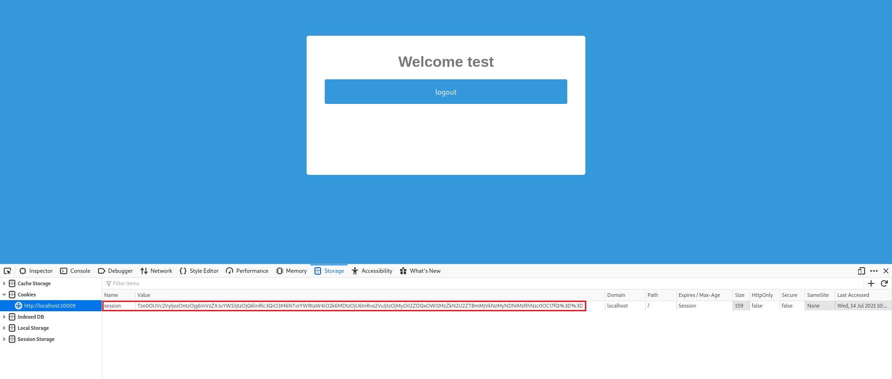
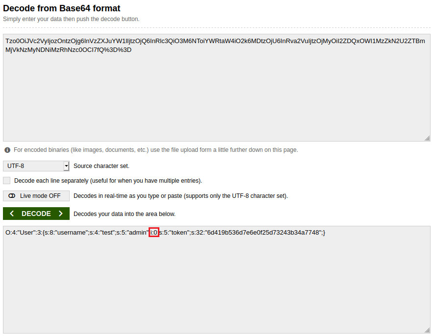
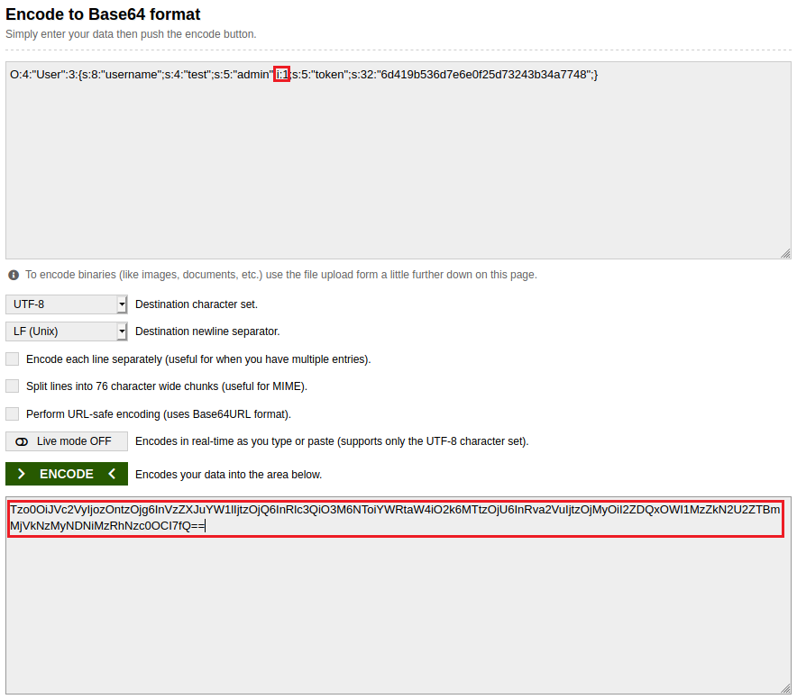
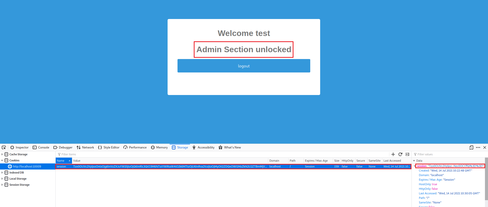

# Admin Login

<p align="center">
    
</p>

This is a simple PHP web application that contains an example of an Insecure Deserialization vulnerability and the main goal of this app is to describe how a malicious user could exploit it.

## Index

- [Definition](#what-is-xxe)
- [Setup](#setup)
- [Attack narrative](#attack-narrative)
- [Objectives](#secure-this-app)
- [Solutions](#pr-solutions)
- [Contributing](#contributing)

## What is Insecure Deserialization?

Serialization is the process of translating data structures or object state, into a format that can be stored or transmitted and reconstructed later. Insecure deserialization often leads to remote code execution. Even if deserialization flaws do not result in remote code execution, they can be used to perform attacks, including replay attacks, injection attacks, and privilege escalation attacks.

The main goal of this app is to discuss how **Insecure Deserialization** vulnerabilities can be exploited and to encourage developers to send b3d3cLabs Pull Requests on how they would mitigate these flaws.

## Setup

To start this intentionally **insecure application**, you will need [Docker][Docker Install] and [Docker Compose][Docker Compose Install]. After forking [b3d3cLabs](https://github.com/b3d3c/b3d3cLabs), you must type the following commands to start:

```sh
cd b3d3cLabs/owasp-top10-2017/a8/admin-login
```

```sh
make install
```

Then simply visit [localhost:10009][App] ! 😆

## Get to know the app

To properly understand how this application works, you can follow these simple steps:

- Visit its homepage!
- Try to login.

## Attack narrative

Now that you know the purpose of this app, what could go wrong? The following section describes how an attacker could identify and eventually find sensitive information about the app or its users. We encourage you to follow these steps and try to reproduce them on your own to better understand the attack vector! 😜

### 👀

#### Use of an insecure deserialization function allows to access the Admin Section

After reviewing the inputs from the app, it is possible to identify that the login form, as shown in the following picture:


A quick test utilizing `admin` as the username and `Pass@1234` as the password, gives us acess to an Admin Section, as shown below:


Utilizing the [Web Developper Toggle Tools] `Ctrl+Shift+i`, accesing `Storage`, `Cookies`, we can see that the app returns a session cookie, `session`, as depicted below:



After decoding the cookie, using [Base64Decode](https://www.base64decode.org/) webpage, which is in base64, the following structure was found:



If an attacker changes the `i:` value from `0` to `1`, and then encoding again the cookie using [Base64Encode](https://www.base64encode.org/) webpage, he/she could create a malicious cookie to take advantage of it by accessing the **Admin Section**.



Changing the cookie value, changing the final `==` to `%3D%3D`, and refreshing again the webpage, the attacker can access the **Admin Section**, as shown below:



## Secure this app

How would you mitigate this vulnerability? After your changes, an attacker should not be able to:

* Accesing the **Admin Section** with a regular user by changing the cookie value.

## References

* Docker Install:  https://docs.docker.com/install/
* Docker Compose Install: https://docs.docker.com/compose/install/
* App: http://localhost:10009
* Base64Encode: https://www.base64encode.org
* Base64Decode: https://www.base64decode.org
* OpenSSL: https://www.openssl.org
