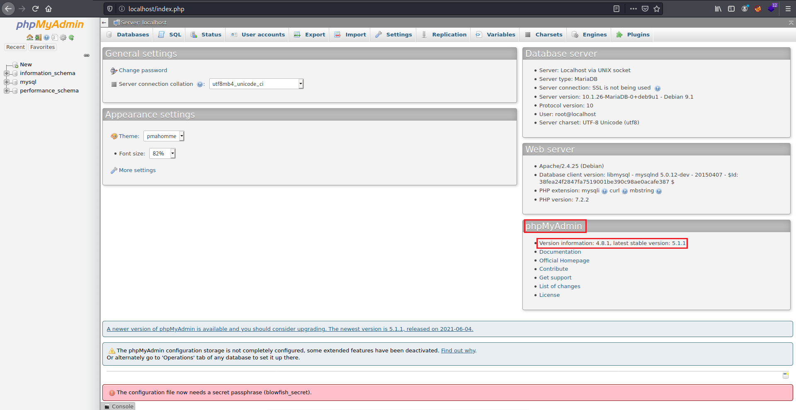
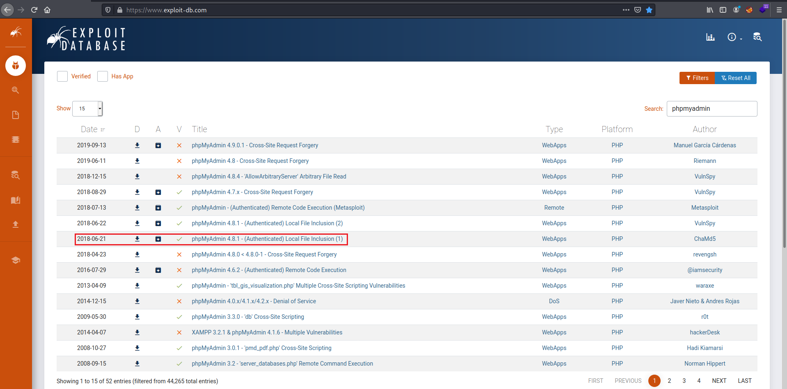
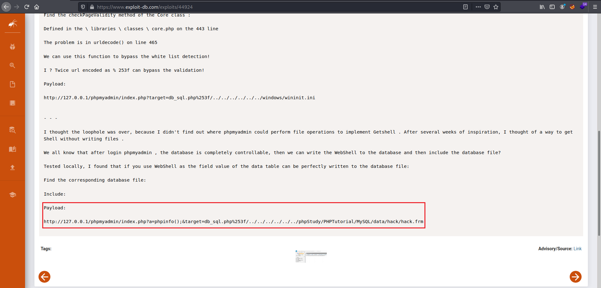
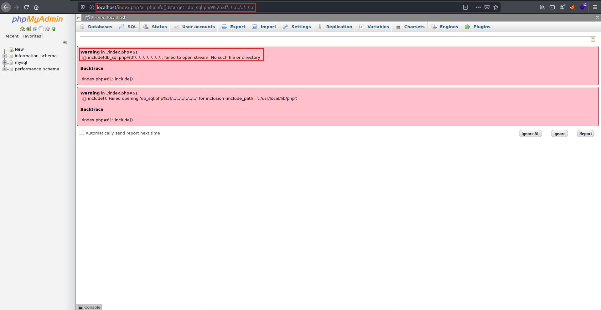
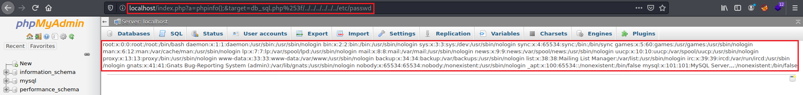

# Admin PHP

<p align="center">
    
</p>

Admin PHP is a simple phpMyAdmin page that contains an example of a component with a known vulnerability and its main goal is to demonstrate how an attacker could exploit it.

## Index

- [Definition](#what-does-it-mean-to-use-a-component-with-known-vulnerabilities)
- [Setup](#setup)
- [Attack narrative](#attack-narrative)
- [Objectives](#secure-this-app)
- [Solutions](#pr-solutions)
- [Contributing](#contributing)

## What does it mean to use a component with known vulnerabilities?

Imagine that components, such as libraries, frameworks, and other software modules, run with the same privileges as the application. If a vulnerable component is exploited, such an attack can facilitate serious data loss or server takeover. Applications and APIs using components with known vulnerabilities may undermine application defenses and enable various attacks and impacts.

The main goal of this app is to discuss how **Using Components With Known Vulnerabilities** can be exploited and to encourage developers to send b3d3cLabs Pull Requests on how they would mitigate these flaws.

## Setup

To start this intentionally **insecure application**, you will need [Docker][Docker Install] and [Docker Compose][Docker Compose Install]. After forking [b3d3cLabs](https://github.com/b3d3c/b3d3cLabs), you must type the following commands to start:

```sh
cd b3d3cLabs/owasp-top10-2017/a9/admin-php
```

```sh
make install
```

Then simply visit [localhost][App] ! 😆

## Get to know the app 🏗

To properly understand how this application works, you could:

- Visit its homepage!

## Attack narrative

Now that you know the purpose of this app, what could go wrong? The following section describes how an attacker could identify and eventually find sensitive information about the app or its users. We encourage you to follow these steps and try to reproduce them on your own to better understand the attack vector! 😜

### 👀

#### Use of a vulnerable phpMyAdmin version allows for local file inclusion


It's possible to reach the server's web application from the standard HTTP port 80, as shown by the image below:


Afterward, by using `root` username and `toor` password, it is possible to authenticate on phpMyAdmin web page. As depicted by the image below, phpMyAdmin version is outdated:



Having the phpMyAdmin version, it's possible to check on [exploit-db][3] if there are any exploits associated with that version, in this case, phpMyAdmin 4.8.1. The results of the search are depicted in the image below:



At the end of the document, you will find the Payload to exploit Linux systems.



First, an attacker would try to access to `http://localhost/index.php?a=phpinfo();&target=db_sql.php%253f/../../../../../../` to check if the system is vulnerable or verifies the input we provide, as shown by the image below:



Finally, by including the full path to the file you want to access, you get its output. For example, obtaining the output of `/etc/passwd` by accessing to `http://localhost/index.php?a=phpinfo();&target=db_sql.php%253f/../../../../../../etc/passwd`, as shown by the image below:



## Secure this app

How would you mitigate this vulnerability? After your changes, an attacker should not be able to:

* Access Linux local files

## References

* Docker Install:  https://docs.docker.com/install/
* Docker Compose Install: https://docs.docker.com/compose/install/
* App: http://localhost:80
* Exploit-DB: https://www.exploit-db.com/
